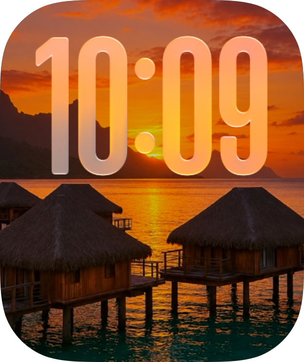

<div>
  <h1>GrateFace </h1>
  <p>Create a Photos watch face from artwork and an optional prepared mask.</p>
  <p>  </p>
</div>

GrateFace handles single-photo Photos faces with the watchOS 27 image-list format I found in faces exported from my watch. It includes a neutral Photos-face seed, replaces every embedded photo, mask, and preview image, and gives the generated photo a new identifier. Supply an optional prepared grayscale mask for clock overlap; without one, the face has no depth occlusion. Its read-only archive inspector can list files in other face types without attempting to generate them.

The [Photos experiment record](Research/Photos/Findings.md) documents each hardware result, the misleading watchOS-version error for blank masks, preview behavior, and what remains untested.

The format writer is experimental because Apple only documents importing existing face files. One mask-free file made by `GrateFaceWriter` has been added and displayed on a watch; masked output and broader compatibility remain untested. Import can fail when the face format or watch compatibility changes. The caller receives a thrown validation, encoding, archive, or file error; successful generation does not prove successful Watch import. The generated previews show the new artwork without a clock. The framed preview draws a thin gray rim and black screen bezel measured from an exported Photos face. The corner reach defaults to 220 and can be changed with `GrateFaceWriter(previewCornerRadius:)` or the Lab slider.

## Installation

Add this repository as a Swift package and link the `GrateFace` library product. For a local checkout, select this folder in Xcode. Its ZIP handling uses [ZIPFoundation](https://github.com/weichsel/ZIPFoundation).

The [GrateFace Lab Xcode project](GrateFaceLab/GrateFaceLab.xcodeproj) is included in this repository as an interactive example. It uses the package from the repository root, but it is a separate app project. Adding the `GrateFace` package to your app compiles the library, not the Lab app or its source files.

## Example face

[PhotosLandscape.watchface](Examples/PhotosLandscape.watchface) is a single-photo face with a landscape image and both complications off. It is an example file for inspection and import experiments; the package does not use it as its default seed.



The example was rebuilt from a supplied export. Its four photo images and two previews were re-encoded without source image metadata, the export's photo identifier and resource filenames were replaced, and archive timestamps were reset. The photo remains visually recognizable, so it may still reveal the pictured place. The rebuilt file passed archive and metadata checks but has not been imported on a watch.

## Quick start

Given finished artwork and an optional full-canvas grayscale mask:

```swift
import GrateFace
import CoreGraphics

let faceURL = try GrateFaceWriter().makeFace(artwork: artwork, mask: subjectMask)
```

`artwork` is the complete image. `subjectMask` is an optional, already prepared grayscale image with the same pixel dimensions: white covers the clock, black leaves it visible. The host app decides what belongs in the mask and creates it. Omit `mask:` when no part should cover the clock. The returned URL points to a unique temporary file; keep it until import or sharing finishes, and copy it if it must persist. Advanced experiments can initialize `GrateFaceWriter(templateURL:)` with another exported Photos face.

On iPhone, the app can then hand the resulting URL to `CLKWatchFaceLibrary().addWatchFace(at:)` or share the file.

## Documentation

The [DocC catalog](Sources/GrateFace/Documentation.docc/GrateFace.md) covers [getting started](Sources/GrateFace/Documentation.docc/GettingStarted/GettingStarted.md) and the [Photos format contract](Sources/GrateFace/Documentation.docc/FaceFormat/FaceFormat.md). Public symbols carry their parameter and error contracts inline.
